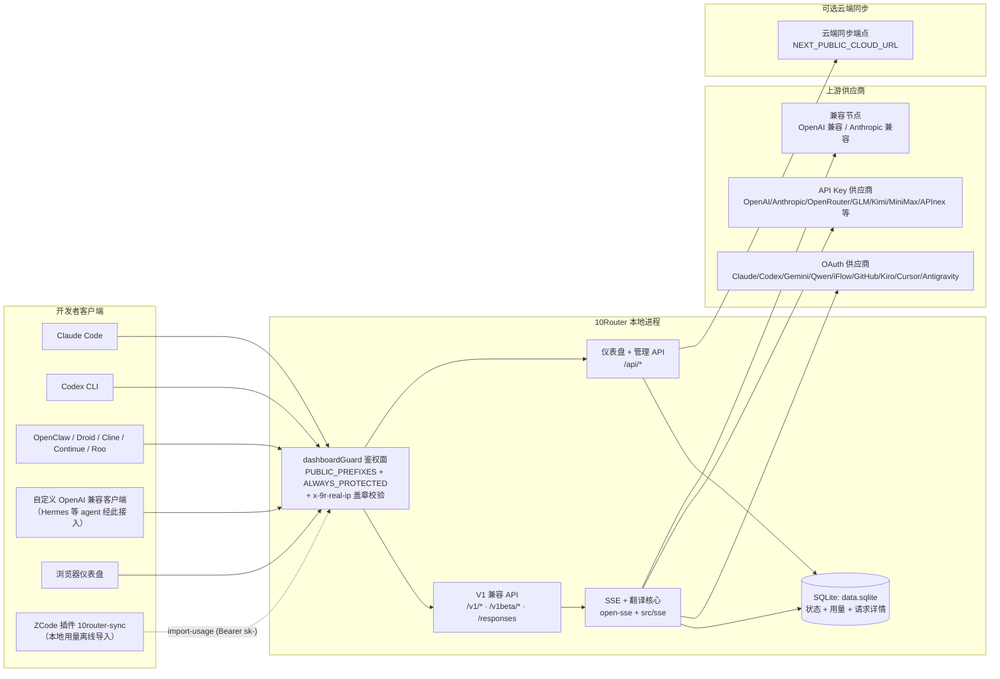
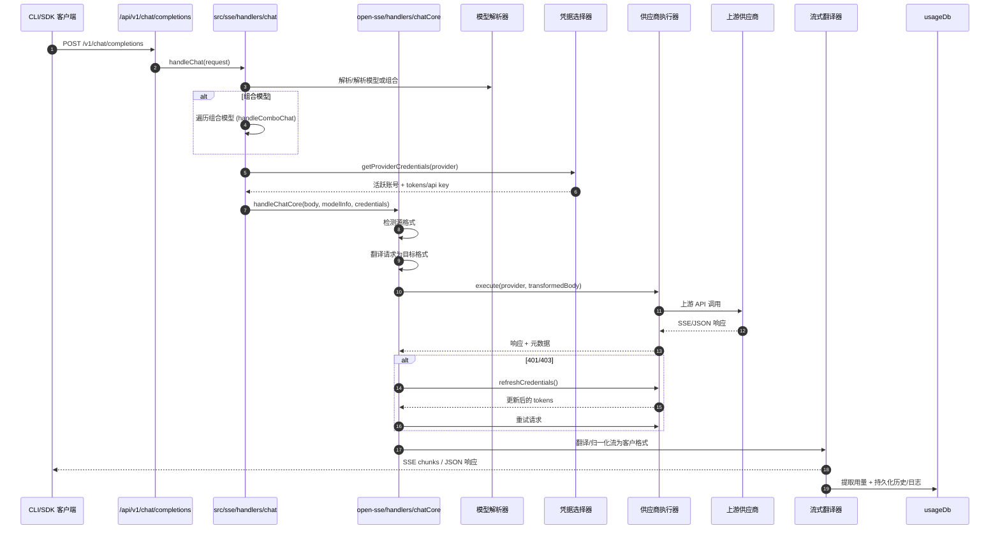
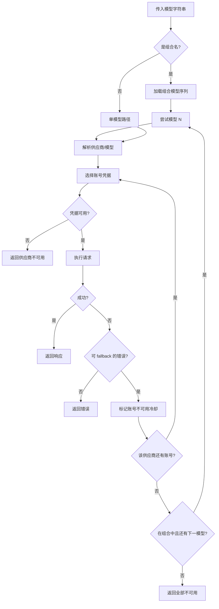
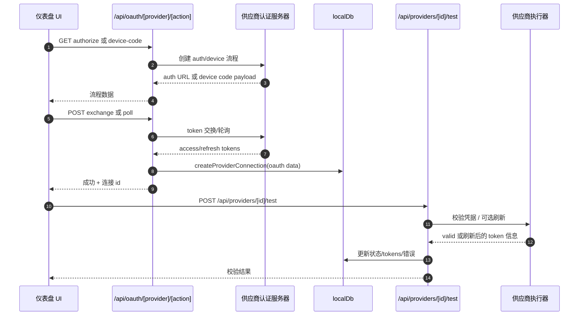
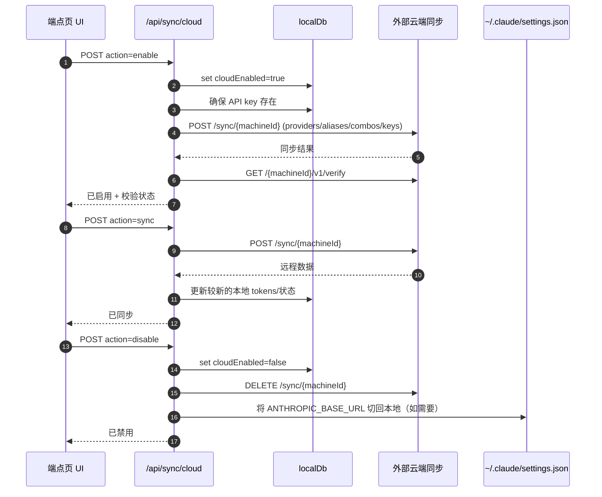
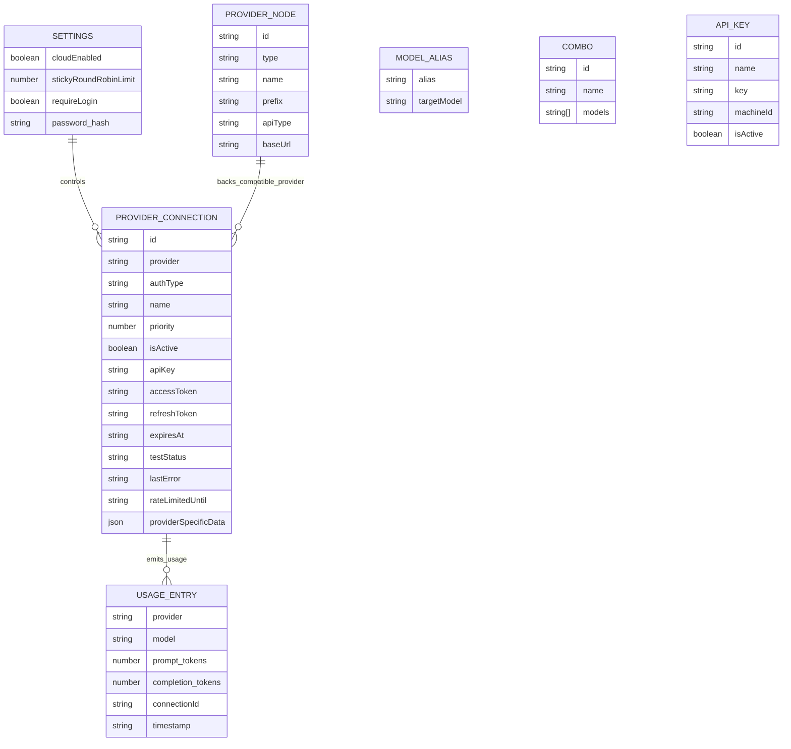
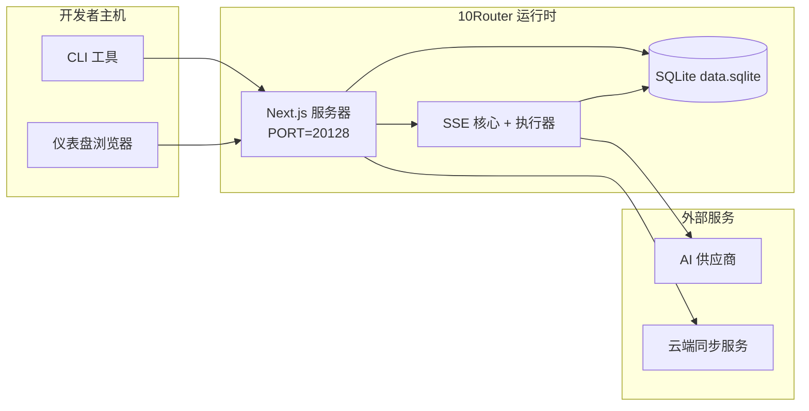

# 10Router 架构

_最后更新：2026-09-07_

## 摘要

10Router 是一个基于 Next.js 的本地 AI 路由网关与仪表盘。它暴露**单一的 OpenAI 兼容端点**（`/v1/*`），将流量路由到多个上游供应商，并具备格式翻译、fallback、token 刷新与用量统计能力。

核心能力：

- 面向 CLI / 工具的 OpenAI 兼容 API 表面（`/v1`、`/v1beta`、`/responses`，Claude/Anthropic 原生格式同口接收）
- 跨供应商格式的请求/响应翻译
- 模型组合 fallback（多模型序列）
- 账号级 fallback（每供应商多账号）+ 后台刷新防风控抖动
- OAuth + API-key 供应商连接管理
- 本地持久化：供应商、Key、别名、组合、设置、定价
- 用量/成本统计与请求日志（含请求详情、ZCode 插件离线导入）
- 可选云端同步（多设备 / 状态同步）

主要运行时模型：

- `src/app/api/*` 下的 Next.js 路由同时实现仪表盘 API 与兼容 API
- `src/sse/*` + `open-sse/*` 下的共享 SSE/路由核心负责供应商执行、翻译、流式、fallback 与用量

## 范围与边界

### 范围内

- 本地网关运行时
- 仪表盘管理 API
- 供应商认证与 token 刷新
- 请求翻译与 SSE 流式
- 本地状态 + 用量持久化
- 可选云端同步编排

### 范围外

- `NEXT_PUBLIC_CLOUD_URL` 背后的云端服务实现
- 本地进程之外的供应商 SLA / 控制面
- 外部 CLI 二进制本身（Claude CLI、Codex CLI 等）

## 高层系统上下文

## 核心运行时组件

## 1) API 与路由层（Next.js App Routes）

主要目录：

- `src/app/api/v1/*` 与 `src/app/api/v1beta/*`：兼容 API
- `src/app/api/*`：管理 / 配置 API
- `next.config.mjs` 中的 Next 重写将 `/v1/*` 映射到 `/api/v1/*`

重要兼容路由：

- `src/app/api/v1/chat/completions/route.js`
- `src/app/api/v1/messages/route.js`
- `src/app/api/v1/responses/route.js`
- `src/app/api/v1/models/route.js`
- `src/app/api/v1/messages/count_tokens/route.js`
- `src/app/api/v1beta/models/route.js`
- `src/app/api/v1beta/models/[...path]/route.js`

管理域：

- 认证 / 设置：`src/app/api/auth/*`、`src/app/api/settings/*`
- 供应商 / 连接：`src/app/api/providers*`
- 供应商节点：`src/app/api/provider-nodes*`
- OAuth：`src/app/api/oauth/*`
- Key / 别名 / 组合 / 定价：`src/app/api/keys*`、`src/app/api/models/alias`、`src/app/api/combos*`、`src/app/api/pricing`
- 用量：`src/app/api/usage/*`
- 同步 / 云端：`src/app/api/sync/*`、`src/app/api/cloud/*`
- CLI 工具辅助：`src/app/api/cli-tools/*`

## 2) SSE + 翻译核心

主要流程模块：

- 入口：`src/sse/handlers/chat.js`
- 核心编排：`open-sse/handlers/chatCore.js`
- 供应商执行适配器：`open-sse/executors/*`
- 格式检测 / 供应商配置：`open-sse/services/provider.js`
- 模型解析 / 解析：`src/sse/services/model.js`、`open-sse/services/model.js`
- 账号 fallback 逻辑：`open-sse/services/accountFallback.js`
- 翻译注册表：`open-sse/translator/index.js`
- 流式转换：`open-sse/utils/stream.js`、`open-sse/utils/streamHandler.js`
- 用量提取 / 归一化：`open-sse/utils/usageTracking.js`

## 3) 持久化层

状态是 `src/lib/db/` 下的 SQLite 层，带适配器 fallback 链（`driver.js`）：
`bun:sqlite` → `better-sqlite3`（可选原生依赖）→ `node:sqlite`（Node ≥22.5）→ `sql.js`（纯 JS fallback，始终可用）。
`better-sqlite3` 刻意放在 `optionalDependencies`，使没有构建工具时安装也不会失败。

> 关于驱动选择、`better-sqlite3` 为何"构建期必需、运行时几乎不用"的完整说明，见 [SQLite 驱动链](./sqlite-driver-chain.md)。

- 主状态 + 用量/日志表都在同一 SQLite 库 `${DATA_DIR}/db/data.sqlite`（默认 `~/.10router/db/data.sqlite`）。
- `src/lib/localDb.js` 是向后兼容 shim，重新导出 `src/lib/db/index.js`；实体逻辑在 `src/lib/db/repos/*`；schema / 迁移在 `src/lib/db/migrations/`。
- `src/lib/usageDb.js` 是 shim，从同一 DB 层重新导出用量/日志函数（用量统计与请求日志现在是 SQLite 表，不是 `usage.json` / `log.txt`）。
- `src/mitm/*` 在同一数据目录下写入 MITM CA 证书。

数据目录解析（`src/lib/dataDir.js`）：显式 `DATA_DIR` 环境变量优先；否则 `~/.10router`（macOS/Linux）或 `%APPDATA%\10router`（Windows）。首次启动时，若旧 `~/.9router` 目录存在且新目录为空，数据会一次性拷贝迁移（旧目录保留，绝不删除）。

## 4) 认证 + 安全面

- **IP 盖章链**：`custom-server.js` 从 TCP socket 写 `x-9r-real-ip`，并用进程内随机 `NINEROUTER_PEER_TOKEN`（`src/lib/auth/trustedPeer.js`）证明该头是自己盖的——登录限流（`loginLimiter.js`）只信盖章值，客户端自报 `X-Forwarded-For` 不能轮换限流桶
- 仪表盘 cookie 认证：`src/proxy.js`（dashboardGuard middleware，先于 Next rewrites）、`src/app/api/auth/login/route.js`；鉴权由 `PUBLIC_PREFIXES` / `ALWAYS_PROTECTED` 两张表决定，加公开 LLM 路径必须同步进表
- API key 生成 / 校验：`src/shared/utils/apiKey.js`——格式 `sk-{machineId}-{keyId}-{crc8}`，CRC 为 HMAC-SHA256 截断；keyId 用 `crypto.randomBytes`（v1.0.8 起），HMAC 密钥默认走内置兜底（启动告警），实验开关 `API_KEY_ROTATION=true` 才切换为 env → `$DATA_DIR/api-key-secret`（0600）自动生成（会使存量 key 失效，绝不静默迁移）
- CLI token（`x-9r-cli-token`）：加盐机器码（`getConsistentMachineId`），属本机进程互认，不是远程密钥；`import-usage` 等专用路由依赖它 + `ALWAYS_PROTECTED` 前置
- 供应商密钥持久化在 `providerConnections` 条目中
- 通过环境代理变量支持上游调用的可选代理（`open-sse/utils/proxyFetch.js`）

## 5) 云端同步

- 调度器初始化：`src/lib/initCloudSync.js`、`src/shared/services/initializeCloudSync.js`
- 周期任务：`src/shared/services/cloudSyncScheduler.js`
- 控制路由：`src/app/api/sync/cloud/route.js`

## 请求生命周期（`/v1/chat/completions`）

## 组合 + 账号 fallback 流程

fallback 决策由 `open-sse/services/accountFallback.js` 依据状态码与错误消息启发式驱动。

## OAuth 引导与 Token 刷新生命周期

实时流量中的刷新在 `open-sse/handlers/chatCore.js` 内部通过执行器的 `refreshCredentials()` 完成。

## 云端同步生命周期（启用 / 同步 / 禁用）

云端启用时由 `CloudSyncScheduler` 触发周期同步。

## 数据模型与存储映射

物理存储文件：

- 主状态 + 用量 + 请求日志：`${DATA_DIR}/db/data.sqlite`（默认 `~/.10router/db/data.sqlite`）
- 自动备份：`${DATA_DIR}/db/backups/`
- 可选翻译/请求调试会话：`<repo>/logs/...`

## 部署拓扑

## 模块映射（决策关键）

### 路由与 API 模块

- `src/app/api/v1/*`、`src/app/api/v1beta/*`：兼容 API
- `src/app/api/providers*`：供应商 CRUD、校验、测试
- `src/app/api/provider-nodes*`：自定义兼容节点管理
- `src/app/api/oauth/*`：OAuth / device-code 流程
- `src/app/api/keys*`：本地 API key 生命周期
- `src/app/api/models/alias`：别名管理
- `src/app/api/combos*`：fallback 组合管理
- `src/app/api/pricing`：成本计算的定价覆盖
- `src/app/api/usage/*`：用量与日志 API
- `src/app/api/sync/*` + `src/app/api/cloud/*`：云端同步与云向辅助
- `src/app/api/cli-tools/*`：本地 CLI 配置写入器 / 检查器

### 路由与执行核心

- `src/sse/handlers/chat.js`：请求解析、组合处理、账号选择循环
- `open-sse/handlers/chatCore.js`：翻译、执行器分发、重试/刷新处理、流式设置
- `open-sse/executors/*`：供应商特定的网络与格式行为

### 翻译注册表与格式转换器

- `open-sse/translator/index.js`：翻译器注册表与编排
- 请求翻译器：`open-sse/translator/request/*`
- 响应翻译器：`open-sse/translator/response/*`
- 格式常量：`open-sse/translator/formats.js`

### 持久化

- `src/lib/db/index.js`：SQLite DB 层（状态 + 用量 + 请求日志）
- `src/lib/db/driver.js`：适配器 fallback 链（bun:sqlite → better-sqlite3 → node:sqlite → sql.js）
- `src/lib/db/repos/*`：实体仓库；`src/lib/db/migrations/`：schema 迁移
- `src/lib/localDb.js`、`src/lib/usageDb.js`：重新导出 DB 层的向后兼容 shim

## 供应商执行器覆盖

专用执行器（`open-sse/executors/`，每个处理非标准协议或供应商特有行为）：

- `antigravity`（含竞争品牌 prompt 清洗 `ANTIGRAVITY_PROMPT_REWRITES`、配额 summary host 回退）
- `gemini-cli`
- `github`
- `kiro`（EventStream 二进制）
- `codex`
- `cursor`（protobuf 二进制）
- `commandcode`（NDJSON 二进制）
- `codebuddy-cn` / `codebuddy-intl`
- `grok-cli` / `grok-web`
- `opencode-go`（稳定 session 头，免费池防风控）
- `qoder`、`trae`、`windsurf`、`zed`、`iflow`、`kimchi`、`mimo-free`、`devin-cli`、`perplexity-web`、`xiaomi-tokenplan`、`ollama-local`、`azure`

默认执行器路径：

- 其他所有供应商（含兼容节点供应商）使用 `open-sse/executors/default.js`

## 格式翻译覆盖

可检测的源格式：

- `openai`
- `openai-responses`
- `claude`
- `gemini`

目标格式：

- OpenAI chat/Responses
- Claude
- Gemini/Gemini-CLI/Antigravity envelope
- Kiro
- Cursor

翻译依据源 payload 形状与供应商目标格式动态选择。

## 故障模式与韧性

## 1) 账号 / 供应商可用性

- 对瞬时 / 限流 / 认证错误触发供应商账号冷却
- 请求失败前先做账号 fallback
- 当前模型 / 供应商路径耗尽时做组合模型 fallback

## 2) Token 过期

- 对可刷新的供应商做预检查、刷新与重试
- 核心路径中 401/403 刷新尝试后重试

## 3) 流式安全

- 断线感知的流式控制器
- 带流结束 flush 与 `[DONE]` 处理的翻译流
- 供应商用量元数据缺失时的用量估算 fallback

## 4) 云端同步降级

- 同步错误会上报，但本地运行继续
- 调度器具备可重试逻辑，但周期执行默认目前调用单次同步

## 5) 数据完整性

- 缺失键的 DB 形状迁移 / 修复
- localDb 与 usageDb 的损坏 JSON 重置保护

## 可观测性与运维信号

运行时可见性来源：

- `src/sse/utils/logger.js` 的 console 日志
- SQLite 用量表中的每请求用量聚合（`usageRepo`；`requestDetailsRepo` 持有完整请求/响应明细，详情 tab 只读此表）
- 请求状态日志（SQLite `appendRequestLog`；旧 `usage.json` / `log.txt` 文件已废弃，`src/lib/usageDb.js` 仅作兼容 shim 重导出 DB 层）
- 当 `ENABLE_REQUEST_LOGS=true` 时 `logs/` 下的可选深度请求/翻译日志
- 供 UI 消费的仪表盘用量端点（`/api/usage/*`）
- 后台 token 刷新带分级抖动（`BG_REFRESH_GOOGLE_DELAY_MS` / `BG_REFRESH_DELAY_MS`），多账号防风控

## 安全敏感边界

- JWT 密钥（`JWT_SECRET`）保护仪表盘会话 cookie 的校验/签名；占位串启动即拒，自动生成落 `$DATA_DIR/jwt-secret`（0600）
- 初始密码兜底（`INITIAL_PASSWORD`，默认 `123456`）在真实部署中必须覆盖
- API key HMAC 密钥（`API_KEY_SECRET`）：默认内置兜底 + 启动告警；实验开关 `API_KEY_ROTATION=true` 切换为自动生成落盘 `$DATA_DIR/api-key-secret`（0600）——开启会使存量 key 的 CRC 全部失效，必须重新签发
- 登录 500 只回通用文案，内部错误仅写服务端日志
- `REQUIRE_API_KEY` 环境变量**运行时不读**——真实开关是设置 DB 的 `requireApiKey` 行（默认 `true`）
- 供应商密钥（API keys/tokens）明文持久化在本地 DB 中，应在文件系统层面保护；`DATA_DIR` 备份/同步等于连密钥一起搬
- 云端同步端点依赖 API key 认证 + machine id 语义

## 环境与运行时矩阵

代码中实际使用的环境变量：

- 应用 / 认证：`JWT_SECRET`、`INITIAL_PASSWORD`
- 存储：`DATA_DIR`
- 安全哈希：`API_KEY_SECRET`、`API_KEY_ROTATION`（实验，默认 off）、`MACHINE_ID_SALT`
- 日志：`ENABLE_REQUEST_LOGS`
- OAuth 后台刷新抖动：`BG_REFRESH_GOOGLE_DELAY_MS`、`BG_REFRESH_DELAY_MS`、`ONBOARD_MAX_ATTEMPTS`、`ONBOARD_RETRY_DELAY_MS`
- 同步 / 云端 URL：`NEXT_PUBLIC_BASE_URL`、`NEXT_PUBLIC_CLOUD_URL`
- 出站代理：`HTTP_PROXY`、`HTTPS_PROXY`、`ALL_PROXY`、`NO_PROXY` 及小写变体
- 平台 / 运行时辅助（非应用特定配置）：`APPDATA`、`NODE_ENV`、`PORT`、`HOSTNAME`

## 已知架构说明

1. `usageDb`（经 `src/lib/usageDb.js`）是共享 SQLite DB 之上的 shim，与其它一切一样遵循 `DATA_DIR`。
2. `/api/v1/route.js` 返回静态模型列表，不是 `/v1/models` 使用的主要模型源。
3. 启用后请求日志会写完整 headers/body；请将日志目录视为敏感。
4. 云端行为依赖正确的 `NEXT_PUBLIC_BASE_URL` 与云端端点可达性。
5. `API_KEY_ROTATION`（实验，默认 off）会更换 key CRC 的 HMAC 密钥——开启后**所有已签发 API key 失效**，须在仪表盘重新签发并更新各客户端；关闭时行为与历史版本一致。
6. 导入的用量行（ZCode 插件）写 `usageHistory` 并打 `meta.imported` 标记；详情 tab 只读 `requestDetails`，两者按时间戳归并展示。

## 运维验证清单

- 源码构建：`cd /root/dev/10router && npm run build`
- 构建 Docker 镜像：`cd /root/dev/10router && docker build -t 10router .`
- 启动服务并验证：
- `GET /api/settings`
- `GET /api/v1/models`
- 当 `PORT=20128` 时，CLI 目标 base URL 应为 `http://<host>:20128/v1`

---

## 相关技术文档

- [SQLite 驱动链](./sqlite-driver-chain.md)
- [用量去重 usageKey 契约](./usage-usageKey-contract.md)
- [JSON 模型目录机制](./json-model-catalog-mechanism.md)
- [MITM 代理安全加固](./mitm-security-hardening.md)
- [CodeBuddy 系统提示失忆修复](./CodeBuddy-agent-amnesia-fix.md)
- [CodeBuddy reasoning_effort 兼容修复](./CodeBuddy-reasoning-effort-fix.md)
